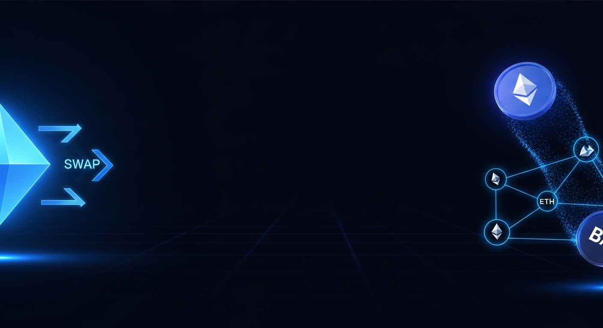

<div align="center">
  
  <h1>BalancerSwap</h1>
  <p><strong>Decentralized Exchange on Ethereum Sepolia</strong></p>
</div>

<div align="center">

[](https://soliditylang.org/)
[](https://hardhat.org/)
[](https://sepolia.etherscan.io)
[](LICENSE)
[](https://react.dev/)
[](https://docs.ethers.org/v6/)
[](https://www.typescriptlang.org/)
[](https://web.dev/pwa)

</div>

---

<div align="center">
  
</div>

---

> **A minimal constant-product AMM (Uniswap v2 style) deployed on Ethereum Sepolia testnet. Swap ETH ↔ $BAL, provide liquidity, and earn fees — all from a slick, dark-themed web UI. Installable as a PWA on mobile.**

---

## Deployed Contracts (Sepolia Testnet)

| Contract | Address | Explorer |
|---|---|---|
| **BALToken (ERC-20)** | `0xD347943bFFB4266eD19C78C55CFBcE08DAB27095` | [View on Etherscan](https://sepolia.etherscan.io/address/0xD347943bFFB4266eD19C78C55CFBcE08DAB27095) |
| **BalancerSwap (DEX)** | `0xAf1B9E1cC6af2450f58d4B9B34Ea4EBe457652cA` | [View on Etherscan](https://sepolia.etherscan.io/address/0xAf1B9E1cC6af2450f58d4B9B34Ea4EBe457652cA) |

> **Network:** Ethereum Sepolia (chainId: `11155111`)
> **Deployer:** `0xFfb6505912FCE95B42be4860477201bb4e204E9f`

---

## Architecture

```
BalancerSwap
├── contracts/              # Solidity smart contracts (Hardhat)
│   ├── src/
│   │   ├── BALToken.sol    # ERC-20 token ($BAL, 1M initial supply)
│   │   └── BalancerSwap.sol # Constant-product AMM + LP token
│   ├── scripts/
│   │   └── deploy.ts       # Deployment script
│   └── hardhat.config.ts
├── artifacts/
│   ├── api-server/         # Express API server (Node.js + TypeScript)
│   └── balancerswap/       # React + Vite frontend
└── lib/
    ├── api-spec/           # OpenAPI 3.1 spec
    ├── api-client-react/   # Auto-generated TanStack Query hooks
    ├── api-zod/            # Auto-generated Zod validators
    └── db/                 # Drizzle ORM + PostgreSQL schema
```

---

## How It Works

### Constant-Product AMM (x * y = k)

BalancerSwap implements the **constant-product formula** made famous by Uniswap v2:

```
ethReserve × tokenReserve = k
```

When you swap ETH for BAL:
```
amountOut = (amountIn × 997 × reserveOut) / (reserveIn × 1000 + amountIn × 997)
```
The `997/1000` factor encodes the **0.3% fee** that stays in the pool, rewarding liquidity providers.

### Pricing

- **Spot price** (no fee): `tokenPerEth = tokenReserve / ethReserve`
- **Output with fee**: uses the formula above
- **Price impact**: increases with trade size relative to pool reserves

### Liquidity Tokens (BALP)

When you add liquidity, you receive **BALP** (LP tokens) proportional to your share:
- **First deposit**: `LP = sqrt(ethAmount × tokenAmount) - MINIMUM_LIQUIDITY`
- **Subsequent**: `LP = min(ethAmount × totalLP / ethReserve, tokenAmount × totalLP / tokenReserve)`

Removing liquidity burns BALP and returns your share of the pool (including accrued fees).

---

## Smart Contracts

### BALToken.sol
- Standard ERC-20 with 18 decimals
- 1,000,000 BAL minted to deployer on construction
- Owner can mint additional tokens via `mint(address, amount)`

### BalancerSwap.sol

| Function | Description |
|---|---|
| `swapEthForTokens(minTokensOut)` | Swap ETH → BAL (payable) |
| `swapTokensForEth(tokenAmount, minEthOut)` | Swap BAL → ETH |
| `addLiquidity(tokenAmount, minLpOut)` | Add ETH+BAL, receive LP (payable) |
| `removeLiquidity(lpAmount, minEthOut, minTokenOut)` | Burn LP, receive ETH+BAL |
| `getEthToTokenPrice(ethIn)` | Quote ETH→BAL (view) |
| `getTokenToEthPrice(tokenIn)` | Quote BAL→ETH (view) |
| `getSpotPrice()` | Spot price in BAL per ETH (view) |

---

## Getting Started

### Prerequisites
- Node.js 24+, pnpm 9+
- MetaMask with Sepolia ETH ([get free Sepolia ETH](https://sepoliafaucet.com))
- BAL tokens (mint from the deployer wallet or via contract)

### Local Development

```bash
# Install dependencies
pnpm install

# Start the API server
pnpm --filter @workspace/api-server run dev

# Start the frontend
pnpm --filter @workspace/balancerswap run dev
```

### Deploy Contracts

```bash
# Set environment variables
export DEPLOYER_PRIVATE_KEY=0x...
export SEPOLIA_RPC_URL=https://...
export ETHERSCAN_API_KEY=...

# Compile
cd contracts && npm run compile

# Deploy to Sepolia
npm run deploy

# Verify on Etherscan
npx hardhat verify --network sepolia <BALToken_address> "<deployer_address>"
npx hardhat verify --network sepolia <DEX_address> "<BALToken_address>"
```

### Environment Variables

| Variable | Description |
|---|---|
| `DEPLOYER_PRIVATE_KEY` | Deployer wallet private key |
| `SEPOLIA_RPC_URL` | Sepolia JSON-RPC endpoint |
| `ETHERSCAN_API_KEY` | Etherscan API key for verification |
| `DATABASE_URL` | PostgreSQL connection string |
| `SESSION_SECRET` | Express session secret |

---

## Using the DEX

### 1. Connect Wallet
Click **Connect Wallet** in the top-right corner. MetaMask will prompt you to connect and switch to Sepolia testnet.

### 2. Swap
- Select swap direction: ETH → BAL or BAL → ETH
- Enter amount — the UI shows your expected output, price impact, and minimum received (after slippage)
- Adjust slippage tolerance: 0.5%, 1%, or 2%
- Click **Swap** and confirm in MetaMask

### 3. Add Liquidity
- Navigate to **Pool**
- Enter ETH and BAL amounts to deposit
- The app calculates how many BALP LP tokens you'll receive
- Confirm the transaction — you'll receive BALP representing your share

### 4. Remove Liquidity
- Enter the BALP amount to burn
- The app shows how much ETH and BAL you'll receive back (including fees earned)
- Confirm to withdraw

---

## Security Notes

- **Not audited** — this is a demo/testnet project. Do not use with real ETH.
- `ReentrancyGuard` is applied to all state-changing functions.
- Slippage protection via `minAmountOut` parameters on every swap/liquidity call.
- `MINIMUM_LIQUIDITY` (1000 wei) locked permanently to prevent pool draining attacks.
- Deployer private key is stored as an environment secret, never in code.

---

## API Endpoints

| Method | Path | Description |
|---|---|---|
| `GET` | `/api/dex/config` | Contract addresses and chain info |
| `GET` | `/api/dex/pool-stats` | Current reserves, price, volume |
| `GET` | `/api/dex/transactions` | Recent swap/liquidity events |
| `POST` | `/api/dex/transactions` | Record a completed on-chain transaction |
| `GET` | `/api/dex/price-history` | Historical ETH/BAL price points |
| `GET` | `/api/healthz` | Server health check |

---

## Tech Stack

| Layer | Technology |
|---|---|
| Smart Contracts | Solidity 0.8.24, OpenZeppelin 5, Hardhat 2.22 |
| Blockchain RPC | ethers.js v6 |
| Frontend | React 19, Vite 7, TypeScript 5.9, Tailwind CSS 4 |
| UI Components | shadcn/ui, Radix UI, Recharts, framer-motion |
| State Management | TanStack Query v5 |
| API Client | Auto-generated via Orval (OpenAPI 3.1) |
| Backend API | Express 5, TypeScript |
| Database | PostgreSQL + Drizzle ORM |
| Monorepo | pnpm workspaces |
| Verification | Hardhat-verify + Etherscan |

---

## License

MIT © [agunnaya001](https://github.com/agunnaya001) — see [LICENSE](./LICENSE) for full text.
